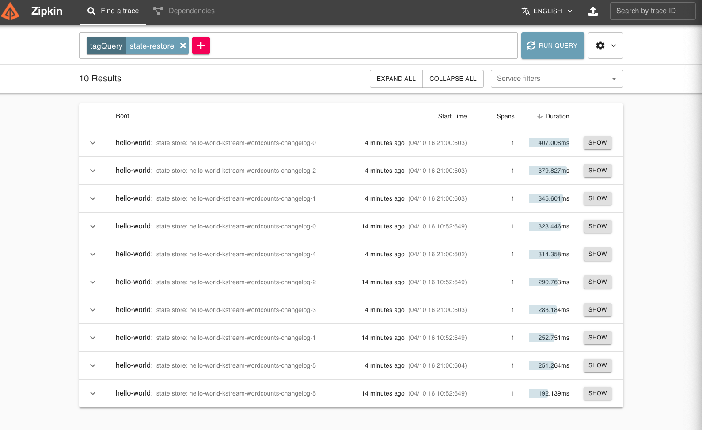
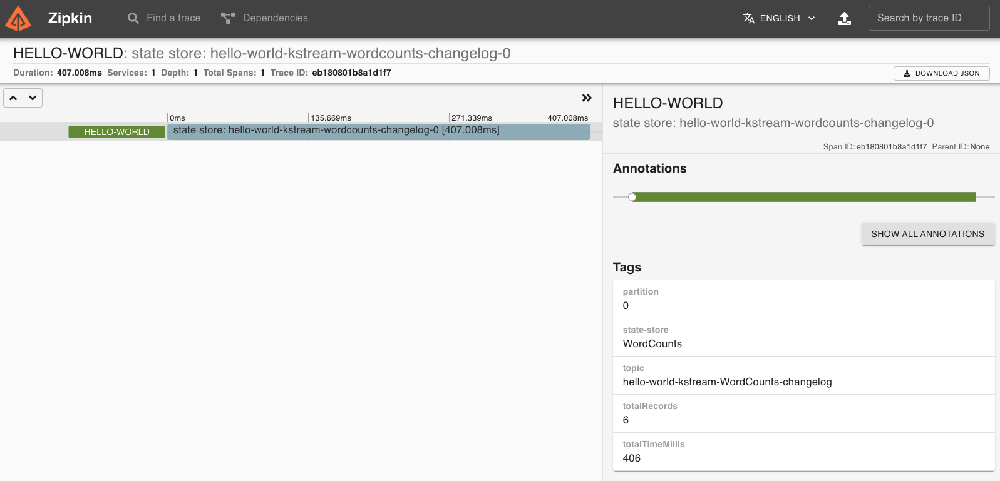

# Kafka Streams StateStore restoration process monitoring (PoC)

This repository demonstrates how to measure **StateStore** restoration process time inside Kafka Streams application.

## Features

* Custom **StateRestoreListener** for gathering metrics.
* **Zipkin** integration for metrics visualization.

## Getting Started

### Prerequisite

* Java 8
* Docker

### Usage

* Build docker image.
  ```shell
  ./gradlew bootBuildImage
  ```

* Start docker-compose demo.
  ```shell
    docker-compose up -d
  ```

* List containers and check if all are `Up`.
    ```shell
    docker-compose ps   
    #                    Name                                  Command                  State                                      Ports                               
    # -----------------------------------------------------------------------------------------------------------------------------------------------------------------
    # kafka-statestore-monitoring_fast-data-dev_1   /usr/bin/dumb-init -- /usr ...   Up             0.0.0.0:8081->8081/tcp, 0.0.0.0:8082->8082/tcp, 3031/tcp,                                                                    
    # kafka-statestore-monitoring_zipkin_1          start-zipkin                     Up (healthy)   9410/tcp, 0.0.0.0:9411->9411/tcp                                   
    # kafka-stream-demo-app                         /cnb/process/web                 Up             0.0.0.0:8080->8080/tcp                                             
    ```

* Follow logs of `demo-app`.
  ```shell
  docker-compose logs -f kafka-stream-demo-app
  ```

* Produce dummy messages to add some data to state store.
  ```shell
  # start kafka console producer
  docker-compose exec fast-data-dev kafka-console-producer --broker-list fast-data-dev:9092 --topic words
  
  # sample logs from 'demo-app'
  # kafka-stream-demo-app    | 2021-04-10 14:17:18.708  INFO [hello-world,,] 1 --- [-StreamThread-1] c.rbiedrawa.app.words.WordCountKStream   : Received word: hello world
  # kafka-stream-demo-app    | 2021-04-10 14:17:21.312  INFO [hello-world,,] 1 --- [-StreamThread-1] c.rbiedrawa.app.words.WordCountKStream   : Received word: test test1
  ```

* Restart demo-app to trigger state store restoration.
  ```shell
  docker-compose restart kafka-stream-demo-app
  ```

* View `demo-app` logs, StateRestoreListener should print some metrics, below sample output:
  ```shell
  kafka-stream-demo-app    | 2021-04-10 14:21:00.603  INFO [hello-world,,] 1 --- [-StreamThread-1] c.r.a.kafka.ZipkinStateRestoreListener   : Started restoration of WordCounts partition 0 total records to be restored 6
  kafka-stream-demo-app    | 2021-04-10 14:21:00.604  INFO [hello-world,,] 1 --- [-StreamThread-1] c.r.a.kafka.ZipkinStateRestoreListener   : Started restoration of WordCounts partition 5 total records to be restored 1
  kafka-stream-demo-app    | 2021-04-10 14:21:00.854  INFO [hello-world,,] 1 --- [-StreamThread-1] c.r.a.kafka.ZipkinStateRestoreListener   : Restored batch 1 for WordCounts partition 5 
  kafka-stream-demo-app    | 2021-04-10 14:21:00.856  INFO [hello-world,,] 1 --- [-StreamThread-1] c.r.a.kafka.ZipkinStateRestoreListener   : Restoration complete for WordCounts partition 5 totalRestoredRecords: 1 totalTime: 251
  kafka-stream-demo-app    | 2021-04-10 14:21:01.011  INFO [hello-world,,] 1 --- [-StreamThread-1] c.r.a.kafka.ZipkinStateRestoreListener   : Restoration complete for WordCounts partition 0 totalRestoredRecords: 6 totalTime: 406
  ```

* Open your web browser and go to [Zipkin dashboard page](http://localhost:9411/).

* Use `tagQuery=state-store` to filter only `state-store` traces.
  

* Click `SHOW` button to see more details.
  
  
* Stop docker compose.
  ```shell
  docker-compose down -v
  ```

## References

* [StateRestoreListener](https://kafka.apache.org/26/javadoc/org/apache/kafka/streams/processor/StateRestoreListener.html)


## License

Distributed under the MIT License. See `LICENSE` for more information.
